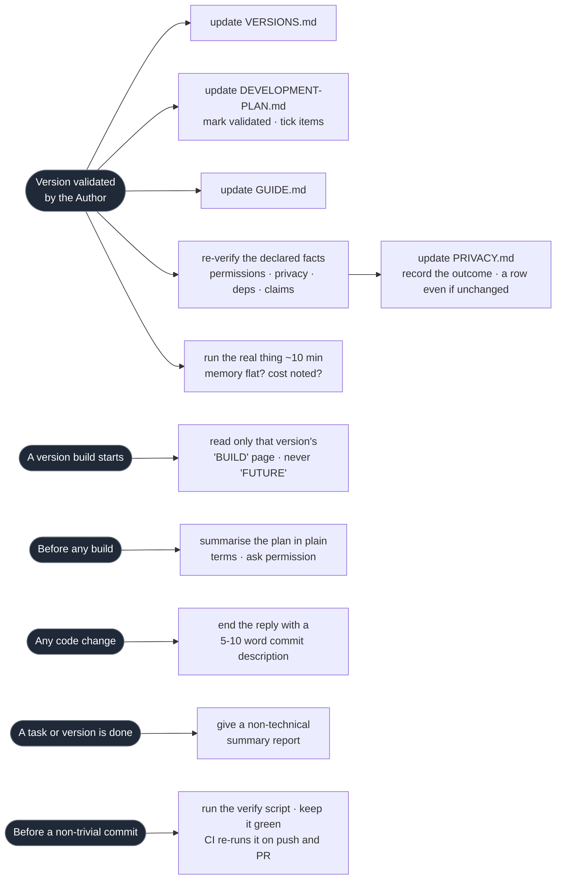

> How Claude Code should work in this repo — the collaboration contract, engineering standards, design rules, and the documents that hold the spec. This file is deliberately stack-neutral and meant to be reused across repos. Product scope and behaviour live in `PRODUCT.md`; the version-by-version build plan lives in `DEVELOPMENT-PLAN.md`.

# Instructions for Claude Code

## About this document
Author: Marek Kultys
Project: see *Project profile* below

This is a **base template**. Everything outside *Project profile* is meant to hold on every repo I work on, so it stays free of any one project's stack, platform or domain. Starting a new repo means: copy this file, rewrite *Project profile*, reset the version tracker to 0.1, and change nothing else. If a rule below turns out to be true of only one project, it is in the wrong place — move it into the profile or into `PRODUCT.md`.

### Version tracker
| Date | Version | Changes |
| ---- | ------- | ------- |
| 30-08-2026 | 0.1 | First generic draft, derived from the SwimCharts `CLAUDE.md` v0.19. Platform, language and domain rules replaced with stack-neutral equivalents; the Apple-specific privacy-manifest and on-device rules generalised into *declared facts* and *runtime observation*; per-project facts fenced into *Project profile*; two practices already visible in my own docs added as rules — record the non-obvious decision, and write down what the model does not know. |

Claude must always observe these rules.

---

## Project profile
<!-- PER-PROJECT. This is the only section that changes between repos. Rewrite it wholesale; leave everything below it untouched. -->

- **Project:** `proto-garden-designer` — a browser prototype of a garden-design simulation for semi-professional garden designers. Draw a plot, plant it, then scrub time of day, time of year and twenty years of growth, and watch the drawing answer back.
- **Stack:** TypeScript (strict), React 18, Vite, zustand, Vitest, Playwright. All drawing is hand-rolled canvas 2D. No CSS framework, no UI component library, no charting library.
- **Run it:** `npm run dev` → `http://localhost:5173`. Two build targets share one source tree: `npm run build`, and `SINGLEFILE=1 npm run build` for one self-contained `dist/index.html` with zero network requests, which is what testers actually receive.
- **Verification:** `npm test` (unit tests over the models), plus the browser checks in `scripts/`, which drive the real app through `window.gardenStore`. There is no single verify script yet — see *Testing and verification*.
- **Documents present:** `PRODUCT.md` (scope, principles, trade-offs, roadmap), `README.md` (how to run it, and why the code is shaped the way it is). Not yet written: `DEVELOPMENT-PLAN.md`, `VERSIONS.md`, `GUIDE.md`, `LINKS.md`.
- **Design source:** none yet. There is no Figma file for this prototype; the design was made in code. The *Design reference* rules below apply from the moment a Figma file exists, and not before.
- **Standing claims about the built artifact:** it runs entirely in the browser, transmits nothing, and stores nothing beyond the tab. `scripts/check-singlefile.mjs` enforces the zero-off-origin-request half of that. Those are the facts the *declared facts* rule has to keep true.
- **Branch flow:** develop on `develop`.

---

## Workflow triggers at a glance
A visual orientation only — the authoritative wording is in the sections below. This is the **triggers** half of the dependency picture (an event → the actions it obliges); `LINKS.md`, once it exists, draws the other half (**derivation** — which artifact is built from which). Together they answer both *"when must I act?"* and *"what else does a change touch?"*.

## Working with a non-engineer
- **Before every build, summarise what you will do in non-technical terms**, focusing on the outcome, and ask for permission to build. I want to understand what you plan to achieve before you achieve it.
- **After completing each task or version scope, give me a non-technical summary report**, focused on what it now does for the person using it rather than on what changed in the code.
- **Whenever you change anything in code, end your reply with a recommended commit description** (5–10 words) I can use when committing.
- **Keep me involved in your thought process.** I may not be an engineer but I am smart and willing to dive into any topic with you. Explain the trade-off you are making, not just the choice.
- **Tell me when I am wrong.** If my instruction conflicts with something already validated, or rests on a premise the code contradicts, say so before building rather than after.

## Reference documents
- **Product definition is in `PRODUCT.md`** — the destination: what it is, who it is for, what it deliberately does not do, and what it is meant to find out. **Read it before implementing any feature.**
- **Build incrementally per `DEVELOPMENT-PLAN.md`** — the path: version scopes and the production-readiness workstream. **Never implement beyond the current version's scope**, even if it is mentioned elsewhere. **Do not change behaviour I have already validated in a shipped version without explicit permission.**
- **On every version I confirm as validated**, run the round below in one pass:
    - `VERSIONS.md` — add the version with a short summary.
    - `DEVELOPMENT-PLAN.md` — mark that version validated and tick any production-readiness items it completed.
    - `GUIDE.md` — reflect any new or changed user-facing behaviour.
    - `PRIVACY.md` — reflect any change to what data is read or stored, or how it can be erased. **Add a tracker row even when nothing changed**, noting that.
    - **Re-verify the declared facts** and **run the runtime observation** — the two bullets below.
- **Declared facts about the shipped thing must be re-tested, never assumed.** Every project accumulates files that state facts about the *built artifact* rather than about the source: a privacy manifest, a permissions or entitlements list, an app-store data label, a dependency and licence inventory, a `Content-Security-Policy`, or a plain claim in the README such as *"makes no network requests"*. These go stale silently — the moment a new API, a new dependency or a new fetch appears — and the failure surfaces late and expensively, as a store rejection or a broken promise to a user. So on every validated version, **grep the source and re-confirm each claim**, one by one, rather than reasoning that it is probably still fine:
    - List the claims the project makes and where each is asserted.
    - For each, name the thing in the code that would falsify it, and search for it.
    - Note that debug-only or test-only code paths are not in a release build and do not count.
    - **Adding networking, analytics, telemetry or any third-party dependency invalidates the whole set. Flag that to me rather than quietly editing the file**, because it also changes what the user is being told.
    - Record the outcome in the `PRIVACY.md` tracker row, including *"still accurate, no change"* — the value is the trail.
- **Runtime observation — every validated version.** A test suite and a build answer *"does it compile, and are the numbers right?"* They never run the thing for any length of time, so **in a typical project nothing observes behaviour over time at all**. That gap once shipped a memory leak growing ~1.5 MB/s that killed the app after about fifteen minutes; it survived a full code audit (the API usage looked correct, because it was), CI, and 130 passing tests, and was found only when the app died in my hand. So on every validated version, **run the real thing for about ten minutes and watch the resource gauges**:
    - **Memory** — the *shape* matters, not the number. It should rise while things load, then sit **flat**. A line that climbs and never returns is a leak, however small it looks per second.
    - **CPU / energy / frame cost** — note the figure and what dominates it, so that a regression is visible against the last reading rather than judged in isolation.
    - Do this **on the real target — real device, real browser, production-like build — not a simulator or emulator**. Emulated memory figures overstated real hardware by ~7.7× when measured. They are usable for *shape* and worthless as absolutes.
    - Record the outcome in the `DEVELOPMENT-PLAN.md` tracker row for the version, **including "flat, no change"** — the value is the trend across versions, which only exists if the boring readings are written down too.
- **Version Tracker rows are an index, not a narrative.** Each row says *what changed and why* in **one or two sentences (~350 characters)** and **points at** the section, item, or sibling document that carries the detail — it never restates it. Keep out: file names, API calls, exact values, test counts, and the blow-by-blow of what was tried before it worked; those belong in the code, the spec section, or the plan item. A row that needs more than two sentences is a sign the detail belongs somewhere else. **Append new rows below the last one**, ascending by version and date — never insert above.
- **`LINKS.md` maps the derivation chains** — which artifact is built from which (design → `PRODUCT.md` → codebase → declared facts → `PRIVACY.md`, plus fixtures, tests, `GUIDE.md`, `VERSIONS.md`) — so that a change points you at what else to re-verify. The version-close triggers above are *not* duplicated there; it points back here. **If a new derivation dependency appears** — a new document, source, or generated artifact — **update `LINKS.md`.**
- **Write down the decision that looks arbitrary.** When the obvious implementation is wrong and the fix is not self-evidently better, record *the failure it avoids*, not just the fix — in a comment where it is short, in the README where it shapes the whole codebase. The next reader, me included, will otherwise "simplify" it straight back into the bug.
- **Be honest about what the model does not know.** Where an implementation simplifies reality, say so in `PRODUCT.md` under known trade-offs rather than smoothing over it. A stated limitation is a feature of the document; a hidden one is a defect in the product.

## Code structure
- **One feature per file.** Keep view and component bodies short — extract a subview if the body runs past ~50 lines.
- **Separate the layers:** data access, business logic, and presentation. Never reach for data from inside a view, and never put a calculation somewhere it cannot be tested without a UI.
- **Derived state is a function, not a copy.** Anything that can be computed from inputs should be computed from inputs, rather than stored alongside them and kept in sync by hand. Two sources of truth for one fact will disagree.
- **All design token values — colours, typography, spacing, timings — are referenced from a central constants file, never hardcoded inline.**
- **Handle the absent case explicitly.** No force-unwrapping, no non-null assertions, no `as any`, no empty catch. If the type checker is in the way, it has found something; do not suppress it to get past it. Run the language's strictest reasonable settings and keep them on.
- **Use the language's modern async idiom** (`async`/`await` or equivalent) rather than callbacks, and keep concurrency confined to a deliberate boundary rather than scattered through the code.
- **Do not restructure build or project configuration** — build files, project files, CI definitions, dependency manifests — without asking. I manage those by hand and a silent edit there is expensive to find.
- **Use the ecosystem's standard package manager**, and only one.

## Design reference
Applies from the moment a design file exists; before that, say so rather than inventing a design.

- **Design is connected via MCP.** Read the design file directly through the connection, not through exported assets.
- **When each version build starts, I will give you the link to that version's page. Only read and implement frames from that page.**
- Pages ready to build are labelled **"v[x.x] — BUILD"**. Pages labelled **"v[x.x] — FUTURE"** are out of scope. **Never read or implement anything from a FUTURE page**, even when it is visible in the file.
- Implement to match the design — layout, spacing, typography, colour, copy, and component structure.
- **If the design conflicts with `PRODUCT.md`, flag the conflict to me before building. Do not resolve it yourself.**
- **If a screen is not yet designed, do not build it.** Ask me first.
- Treat any out-of-scope frame, including a future version's, as reference only — never as something to build.

## Source of truth: design vs code
The design file is the **default** source of truth for the whole design — a build matches it for everything: layout, spacing, typography, colour, composition, copy. I then review the built thing on the real target, where things read differently than they do on a design canvas, and tweak values directly in code. Those tweaks rarely go back into the design file, so the design file drifts.

Each in-code tweak is **pinned** with a `CODE-OWNED:` comment plus a one-line reason. The tag is a per-value lock, independent of category — it can sit on a font size, a padding, an alignment, a colour, anything:
- **A pinned value wins over the design file and is never changed to match it during a build**, even if the design now differs. Only I lift a pin, or say explicitly that the design value supersedes.
- **Untagged values stay design-driven** — a build may update them freely as the design evolves.
- `grep -rn CODE-OWNED` lists every pinned value. That grep *is* the ledger, so there is no need to track which side changed first — the tag is the record.

(Separately, any displayed number comes from the spec's formulas and the real data, never from a value typed into the design file.)

## Design tokens
- **Brand colours, typography and spacing are defined once, in the project's constants file, and named** — see *Project profile* for where. Never introduce a raw value inline.
- **Use the platform's system font unless the project defines a custom one.** Never invent a font.

## Testing and verification
- **Write unit tests for all calculation, aggregation and derivation logic**, at each merge.
- **Test the models against published figures, not against their own output.** A test that asserts a function returns what it currently returns proves only that nobody has touched it. Where a real-world reference exists — a published table, a standard, a measured value — assert against that. Where it does not, assert the properties that must hold: monotonic, bounded, conserved, symmetric, never negative, and internally consistent with the other axes.
- **Pre-test against frozen real data before testing on the real thing.** Where sample data exists, freeze a copy as a golden fixture, run the logic over it, and assert the outputs match the known-good values. This catches the arithmetic without a device, a browser or a network in the loop.
- **Before committing anything non-trivial, run the project's verify script and keep it green.** One script, run by one command, that does every device-free check in one pass — type check, unit tests, every build target, and any structural checks. **CI runs the same script** on every push to the integration branches and every pull request, so a red CI is a real regression rather than a difference of environment. If the project has no such script yet, that is the first thing worth building.
- **Automated checks never replace using it.** Anything involving real hardware, real permissions, real data or the look of the thing stays validated by me on the real target.

## Git and branches
- **I do all git non-read operations: commit, push, merge, tag, branch.** Read-only git — `status`, `log`, `diff`, `show` — is fine and encouraged.
- **Branch flow.** Work happens on a `build-v*.*` branch; batches of roughly 10–15 commits are opened as a pull request into `develop`; `develop` merges into `main` only once a full version is validated on the real target. So expect the working branch to be `build-v*.*`, never commit to `develop` or `main` directly, and note the integration branch is **`main`** — there is no `master`. CI triggers on all three, plus every pull request.

## What not to do
- **Never add a third-party dependency without my explicit approval.** Each one is a thing to audit, update, and declare.
- **Never implement a feature that is not specified in `PRODUCT.md`.**
- **Never assume a missing specification. Ask me rather than inventing behaviour** — an invented behaviour that happens to be reasonable is harder to find later than one that is obviously wrong.
- **Never widen the scope of a fix.** Fix what is broken; tell me about the rest.
- **Never delete or rewrite my work to make a check pass** — not a test, not a validated behaviour, not a document. If something has to give, say what and why, and let me choose.
