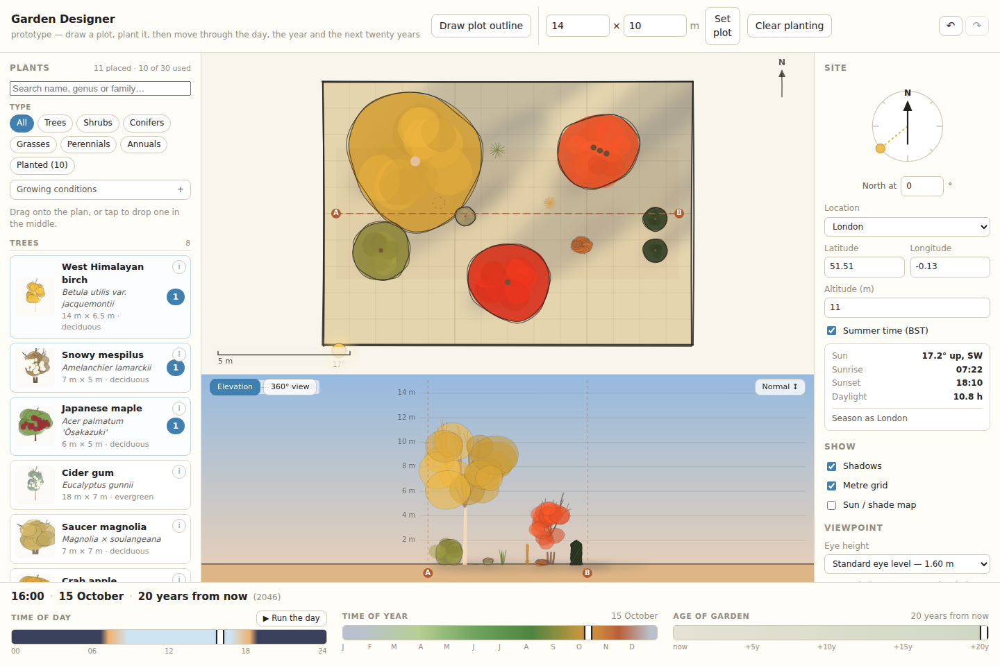

# Garden Designer — product description

A prototype of a garden-design simulation for semi-professional garden designers.
You draw a plot, plant it, and then move the garden through time: the hour of the
day, the week of the year, and the next twenty years of growth. The drawing
answers back — shadows swing round and lengthen, the light warms towards evening,
leaves arrive and colour and fall, and the planting grows up until a whip of a
birch is a tree that shades half the garden.

This document is about the product: where it came from, who it is for, what it
does, what was deliberately left out, and what it is meant to find out. For
running the code, see [`README.md`](README.md).

---

## Where it came from

The brief that started this asked for a browser-launchable prototype of a garden
design simulation app, to support **ideation and early testing of garden ideas**,
and to be **tested with gardeners for feedback**. In its own terms it asked for:

- a plot of land drawn on a canvas
- a drag-and-drop **plant library**, listing plants by **English and Latin name**,
  categorised by genus, family, type, colour, size and variety
- plants drawn in a **sketchy line-art style, with colour**
- plants that can be **moved around the plot**
- the ability to say **where north is**, **where on the globe** the garden is, and
  **how high above sea level** — so that weather and seasonal conditions can be
  simulated
- **sliders for time of day, time of year, and age of the garden out to twenty
  years**
- a design that **reacts to those sliders**: plants changing size, colour and
  shape; shadows moving and the light warming and cooling through the day; leaves
  dropping or staying green and autumn colour arriving with the season; plants
  growing according to their annual growth rate over the years

Soil type and suitability alerts were named as a later step.

Two constraints did more to shape the result than any of the features:

> *"Limit the library to a few representative plants, but do research on them."*

> *"I want to test the depth of interaction with this application idea rather
> than make it comprehensive."*

That is a decision about what the prototype is for. It is not a plant database
with a viewer attached; it is a simulation with just enough plants to exercise
it. Everything below follows from taking that seriously.

A few open questions were settled before building:

| Question | Decision |
|---|---|
| Which views? | Plan view as the main canvas, with an elevation strip beneath it |
| How delivered? | A repo app to iterate on, **and** a single self-contained HTML file to send to testers |
| Where in the world? | UK / north-west Europe, London by default, metric throughout |
| Which optional extras? | The sun/shade overlay only — soil alerts, save/load and a plant info panel were cut |

Everything after that came from using it: thirty plants instead of ten, a phone
layout, a 360° view from inside the garden, adjustable eye height, duplicating a
plant in place, undo, and filtering the library by growing conditions.

## Who it is for

Semi-professional garden designers, at the stage where an idea is still soft —
working out where the tree goes, whether the terrace will still get evening sun
in ten years, what the border does in February. Not a documentation or
specification tool, and not for the finished planting plan.

## The problem it addresses

A planting plan is a drawing of a single instant, and that instant is never the
one that matters. It is drawn at nursery size on a summer's day, and everything
a client actually asks about is somewhere else in time:

- *What does it look like in October?*
- *Will that tree shade the terrace at breakfast?*
- *How big is this in ten years?*
- *Is there anything there at all in January?*

Those questions get answered from experience and imagination, and they get
answered differently by the designer and by the client, who are not picturing the
same garden. This prototype tries to put the answer on screen, so the two of them
are looking at the same thing and can disagree about something real.

## Principles

**Depth over breadth.** Thirty plants, each researched against its RHS entry and
simulated seriously, rather than a hundred stubs. Every entry in the palette
carries its source URL.

**Real models, not plausible fakes.** The sun is the NOAA solar position
algorithm, not a sine wave — because a gardener will spot a fake sun immediately,
and because a real one makes latitude, altitude and the north dial genuinely
consequential rather than decorative. The same goes for growth curves and leafing
dates.

**Honest about what it does not know.** Where the model simplifies, it is written
down (see *Known trade-offs*) rather than smoothed over.

---

## What it does

### Three ways of looking at the garden

**Plan** — the main canvas. Plot outline, metre grid, scale bar, north arrow,
plant footprints and cast shadows.

**Elevation** — a measured slice through the plan, taken along a sight line you
can drag to either end. Plants in the band are drawn side-on against a height
ruler, depth-sorted. This is where height, silhouette, leaf-drop and autumn
colour are legible.

**360°** — an eye placed anywhere on the plan, which you drag to turn and tilt.
Plan and elevation are both drawings; this is the first view that answers what a
client actually asks — *what will it look like from the terrace* — and it is a
genuinely different projection, where distance matters and a shrub two metres
away can hide a tree twenty metres off. Eye level is adjustable, from a
seven-year-old to a tall adult, with a separate ground offset for a raised
terrace or an upstairs window.

### The plant library

Thirty plants, searchable by common name, Latin name, genus or family, each card
showing both names, mature dimensions, foliage type and a sketch thumbnail. Drag
onto the plan to place; on a phone, tap to drop one in the middle and then drag
it into position.

A **planted count** on each card shows how many of that plant are already on the
plan, and clicking it steps the selection through them.

Filtering runs on six axes. Type and a *Planted* toggle stay visible; the rest
fold behind a **Growing conditions** disclosure:

| Axis | Values |
|---|---|
| Type | trees · shrubs · conifers · grasses · perennials · annuals |
| Aspect | full sun · dappled shade · semi shade · shade |
| Soil type | clay · loam · sand · chalk |
| Soil pH | acidic · neutral · alkaline |
| Drainage | free draining · water retentive · waterlogged · bog · pond |
| Foliage | deciduous · evergreen · dies back |

Chips that would empty the list are **dimmed rather than hidden**, given the
filters already set. That admits honestly where the palette is thin — *bog* and
*pond* match nothing, because there are no marginals or aquatics yet — and it
surfaces real horticulture: choose dappled shade and chalk together and the
*Trees* chip dims, because every dappled-tolerant tree here is a lime-hater.

Dappled shade is treated as a category in its own right, not a midpoint between
sun and shade. It is the moving, broken light under a deciduous canopy, and it is
what a hellebore or a Japanese maple actually wants rather than merely tolerates.

### Placing and editing

Drag to place, drag to move. Right-click a plant — long-press on a touchscreen —
for **Add another**, which plants a second of the same kind just beside it, or
⌘/Ctrl-D on the selection. Planting is done in threes and fives rather than ones.
The copy gets fresh randomness, so it is a second plant of the same kind rather
than a clone of the same individual.

**Undo** is ⌘/Ctrl-Z, redo ⇧⌘Z or Ctrl-Y, with buttons in the header that name
what they will undo. It covers the design — planting and the plot outline — and
not the view: scrubbing to April or turning to face west are not edits, and
including them would bury a deleted border under a scrub of the season slider.

### The site

North set by a draggable dial, latitude and longitude by UK preset (London,
Bristol, Manchester, Edinburgh, Penzance, Aviemore) or free entry, and altitude
in metres. A live readout gives sun altitude and compass direction, sunrise,
sunset and daylight hours, and says how the growing season shifts relative to
London.

### Time

Three sliders — time of day, time of year, age of garden out to twenty years —
with a combined readout and a button that runs the day. Everything on all three
canvases is a function of those three numbers and the site, so nothing is ever
out of step with anything else.

### Sun and shade

An overlay that walks the sun across the sky and accumulates how much direct sun
each quarter-metre of the plot receives on that day, banded into the vocabulary
designers use: full sun, partial shade, shade, with the percentage of the plot in
each.

### On a phone

The page never scrolls on a phone, deliberately. Published as an artifact it
lives inside a sheet in a host app, and a swipe past the end of the document
chains upward and reads as a dismiss — the pane closes underneath you mid-gesture.
So the phone layout fits the viewport exactly, with the library and site settings
as sheets that slide up over the canvas and scroll internally.

---

## What is simulated, and why a designer can trust it

**Sun position.** The NOAA solar position equations — fractional year, equation
of time, declination, hour angle, then altitude and azimuth. Sunrise and sunset
come out within a couple of minutes of published times, and the tests check that
against London figures rather than against the code's own output. At London the
noon sun reaches about 62° at midsummer and about 15° at midwinter, so the same
tree throws a shadow roughly four times longer in December than in June, for
free. British Summer Time is applied on the UK/EU rule, so a June evening still
has sun at 21:00.

**Light colour.** Sun altitude sets a colour temperature, from about 1900 K at
the horizon to 5800 K high. Hue and brightness are applied separately — the tint
is whichever light is falling on a surface, the beam in sun or the blue sky in
shadow, normalised so that it only shifts colour, with brightness applied on top.

**Growth.** A logistic curve from nursery stock to mature size, with height and
spread on separate curves, which reproduces the familiar habit of a young tree
shooting upward for a decade before broadening out. Clipped subjects like the yew
gain a fixed amount each year and then stop, because somebody is cutting them.
Where a nursery gives a realistic twenty-year size well below the RHS *ultimate*
figure, the curve is tuned to hit the twenty-year number, since that is the range
the slider covers.



**Phenology.** Day-of-year anchors per species — bud burst, full leaf, autumn
onset, leaf fall, flowering — smoothed into a continuous phase. Anchors shift
with the site using Hopkins' bioclimatic law: spring about four days later per
degree of latitude north and per 120 m of altitude, autumn the other way. Put the
same garden 400 m up and bud burst slips a fortnight while leaf fall comes a
fortnight early. This is what makes the altitude field do real work.

**Sun and shade.** The sun is stepped across the sky and every canopy projected
onto the ground, accumulating light per cell over the whole daylight window.

## The plant palette

Thirty plants, chosen to span the axes the simulation exercises — vigorous to
slow, evergreen to fully dormant, sun to deep shade, tree to groundcover.

**Trees** — West Himalayan birch, snowy mespilus, Japanese maple 'Ōsakazuki',
cider gum, saucer magnolia, crab apple 'Evereste', Tibetan cherry, rowan.
**Shrubs** — panicle hydrangea 'Limelight', English lavender, mānuka, dogwood
'Midwinter Fire', laurustinus, shrub rose 'Gertrude Jekyll', Mexican orange
blossom 'Sundance'. **Conifers** — clipped yew, dwarf mountain pine.
**Grasses** — feather reed grass 'Karl Foerster', giant oat grass, maiden grass.
**Perennials** — hosta 'Halcyon', purple top, cranesbill Rozanne, salvia
'Caradonna', coneflower, lady's mantle, black-eyed Susan, Lenten rose,
ornamental onion. **Annuals** — cosmos.

Several exist to exercise a specific behaviour, and it is worth knowing which,
because each is a case where a naive implementation silently does nothing rather
than failing loudly:

| Plant | What it exercises |
|---|---|
| Saucer magnolia | flowers on completely bare wood, weeks before a leaf |
| Laurustinus | a flowering window that crosses the new year (November–April) |
| Dogwood 'Midwinter Fire' | grown for the colour of its leafless stems |
| Crab apple, rowan | fruit still held long after leaf fall |
| Ornamental onion | a bulb: dormant in high summer, not in winter |
| Cosmos | an annual — the same size in year 20 as in year 1 |
| Giant oat grass | evergreen foliage *and* standing winter seedheads at once |
| Cider gum | the fastest grower here, and evergreen, so it shades in winter too |

---

## Deliberately not built

**Suitability alerts.** The plant data now carries aspect, soil pH, soil type,
drainage and a hardiness rating, and the library filters on all of them — so you
can find plants for a chalky, dry, shady corner. What does *not* exist is the
other direction: nothing warns you when a plant already on the plan is in the
wrong place. That is the obvious next step, and the data is ready for it.

**Save and load.** Closing the tab loses the design. Worth having before any
unsupervised testing; see the roadmap below.

**A plant info panel.** Cards carry names and dimensions; there is no deeper
per-plant page. Cut to keep the focus on the simulation.

## Known trade-offs

- **The elevation strip has empty sky either side.** Its scale is uniform in both
  directions, so once there is a 14 m tree in a 13 m slice, the vertical is the
  binding constraint and the content cannot fill a short wide strip without
  distorting the drawing. The Compact / Normal / Tall control raises the shared
  scale, which fills the width as a side effect.
- **"Hours of direct sun" counts partial transmission proportionally.** A cell
  under a bare birch that passes 78% of the light accrues 0.78 h per hour. That is
  a reasonable reading of dappled shade, but it is not the strict horticultural
  definition of unobstructed hours.
- **Band thresholds scale on short days.** "Full sun means six hours" is a
  growing-season convention; six hours of an eight-hour December day is 72% of all
  available light, so the thresholds are capped at a share of daylight and the
  legend says so when that applies.
- **Light, not lighting.** Plants are lit as flat tinted shapes. There is no
  self-shading, no shadow cast by one plant onto another's foliage in elevation,
  and no cloud, rain, wind or frost — "weather" here means the sun and the season,
  not the forecast.
- **Bog and pond match nothing.** The drainage axis carries its wet end because
  the axis is only meaningful with it, but there are no marginals or aquatics in
  the palette yet.
- **UK and north-west Europe.** The solar maths is global, but the plant palette,
  the phenology baselines and the summer-time rule are not.

---

## What testing with gardeners should settle

The prototype exists to answer questions about the idea, not about the code:

1. **Is scrubbing time the right interaction?** Does moving through the day, the
   year and twenty years tell a designer something they did not already know, or
   is it a novelty that wears off in a minute?
2. **Which view earns its place?** Plan, elevation and 360° are three answers to
   *what will this look like*. Early signs are that the 360° view is the one that
   makes people stop talking about the drawing and start talking about the garden
   — but that needs testing, not assuming.
3. **Is thirty plants enough to judge the idea?** The bet of this prototype is
   that depth beats breadth. If every session stalls on a missing plant, that bet
   was wrong.
4. **Is the sun/shade map read as analysis or as decoration?**
5. **Would this be shown to a client, or is it a designer's private tool?**
6. **What is the first thing they try to do that it cannot do?**

To set up a scenario directly — on a call, rather than by dragging — the store is
exposed in the browser console:

```js
const s = window.gardenStore.getState();
s.addPlant('betula-jacquemontii', { x: 4, y: 3 });
s.setTime({ doy: 288, hour: 15, year: 12 });   // mid-October afternoon, 12 years on
s.toggle('showOverlay');
```

The moments that have landed hardest so far: the same design at year 0 versus
year 20; mid-October at twenty years, when the birch goes yellow and the maple
scarlet; and January, when half the planting simply is not there — but the
dogwood stems are flaming orange and the laurustinus is in full flower.

---

## Roadmap

### Saving a design as a named project

**Effort: about half a day, plus a couple of hours to make loading safe. No
backend.** The groundwork is done — all state is one plain serialisable object,
and a design is only the plot, the plants and the site. Named projects held in
`localStorage`, with New / Save / Save as / Open / Rename / Delete, need no
network at all.

Two things will bite if ignored, and both are recorded here so they are not
rediscovered the hard way:

- **Looking up a species throws on an unknown id.** A saved design naming a plant
  that was later renamed or removed will fail while rendering and white-screen the
  app — and, because the bad data is still in storage, it will do it again on
  reload. Loading has to filter unknown ids and report *"3 plants could not be
  restored"* instead.
- **The schema has already drifted once** during this build (`soil` became
  `soilPh`; soil type, drainage and lifecycle were added). Saves need a version
  stamp, a migration path forward, and a clear refusal rather than a crash when
  handed something newer than they understand.

Worth knowing about the shape of this: `localStorage` is per-browser and
per-device. A gardener's saved designs stay on that gardener's machine — they
never come back to you, and they are gone if they switch phone or clear site
data. If collecting what testers make matters, the cheap fix is a share link that
encodes the design in the URL *fragment* (never sent to a server, so it works on
static hosting), or export and import of a small JSON file. Neither needs a
backend either.

### Publishing it

**Effort: about an hour. No backend.** `SINGLEFILE=1 npm run build` already emits
a single `dist/index.html` with no external requests at all, so it can be served
by anything that serves a file — and because there are no asset URLs, the usual
sub-path problem on GitHub Pages never arises. One workflow does it.

The constraint to know before choosing where: this repo is private, on a personal
account. GitHub Pages from a private repo needs a paid plan, and below Enterprise
Cloud **the published site is public even when the repo is private** — Pages
access control is an Enterprise feature.

### Keeping it private

**A password prompt written in JavaScript is theatre**, because the whole app has
already been downloaded before the check runs. Two things do work without a
backend:

- **Cloudflare Pages behind Zero Trust Access** — about half an hour of clicking
  and no code. Free for a small number of users, per-tester email one-time-PIN,
  revocable, and the repo stays private. The cost is that the URL is not
  `github.io`.
- **An encrypted build** — the built HTML encrypted at build time and decrypted in
  the browser from a passphrase. Real cryptography rather than obscurity, and it
  stays on GitHub Pages — but only while the source repo is private, since
  otherwise anyone can clone the repo and run it unencrypted. One shared password,
  no revocation.

### Further out

Suitability alerts against the soil and aspect data already held; marginals and
aquatics, so the wet end of the drainage axis means something; more of the plant
palette, once the interaction has been judged worth deepening.
