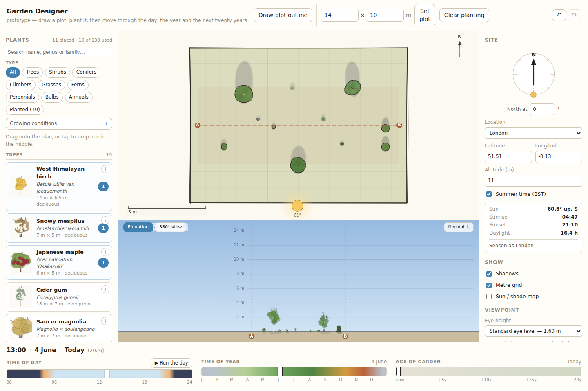
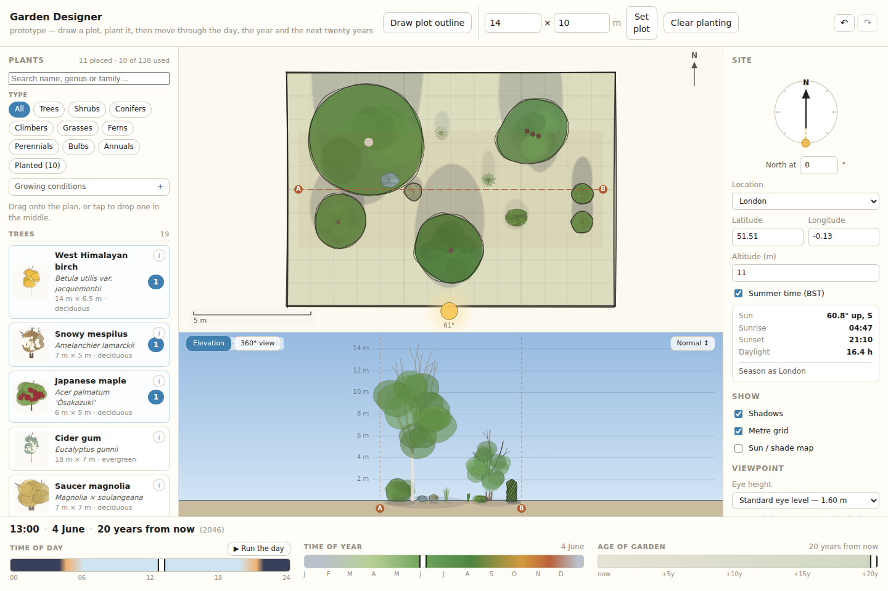
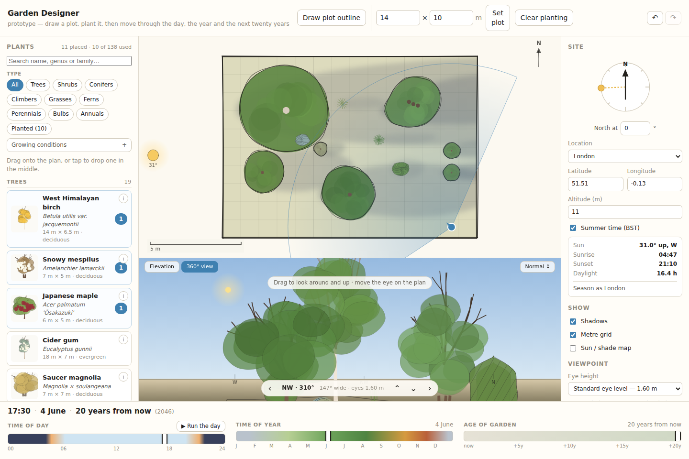
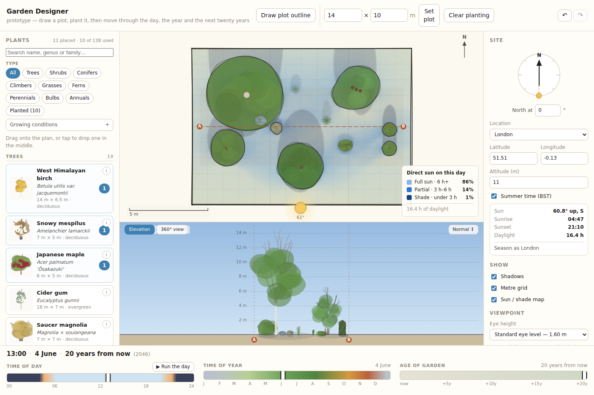

# proto-garden-designer

A prototype of a garden-design simulation for semi-professional garden designers.

Draw a plot, drag in plants, then scrub three sliders — **time of day**, **time of
year**, and **age of the garden** out to twenty years — and watch the design
respond. Shadows sweep round and lengthen, the light warms and cools, leaves come
and go, autumn colour arrives, and the planting grows up.

The same design on the same June afternoon, on the day it goes in and twenty
years later:

| Year 0 | Year 20 |
|---|---|
|  |  |

Three ways of looking at it: the **plan** you arrange on, a measured **elevation**
through a slice of it, and a **360° view** from an eye point inside the garden
that you can turn and tilt.



Built to test whether the interaction idea has depth rather than to be a
comprehensive plant database. A hundred and thirty-eight plants, each researched
rather than invented, chosen to span the axes the simulation actually exercises
— trees, shrubs, conifers, climbers, grasses, ferns, perennials, bulbs and
annuals.

The library is filtered by type and by growing conditions — aspect, soil type,
soil pH and drainage — so a border with dry shade on chalk narrows a hundred and
thirty-eight plants to the handful that will actually take it.

📄 **[PRODUCT.md](PRODUCT.md)** — what it is, where the brief came from, what it
does, what was deliberately left out, and the roadmap.

## Quick start

```bash
npm install
npm run dev        # http://localhost:5173
npm test           # 135 tests
npm run build      # production build into dist/
```

For something you can email to a tester, or open by double-clicking with no
server at all:

```bash
SINGLEFILE=1 npm run build            # one self-contained dist/index.html, ~250 kB
node scripts/check-singlefile.mjs     # confirms it runs from file:// with zero network requests
```

## Project layout

```
src/model/    the simulation — sun, growth, phenology, shade, panorama geometry,
              and the plant data itself (plants.ts)
src/render/   canvas drawing — sketchy line work, the light palette, and one
              draw pass per view
src/state/    a single zustand store; all state is plain and serialisable
src/ui/       React components: the panels, the canvases, the time bar
scripts/      Playwright checks and screenshot capture
```

## What is simulated

Everything on all three canvases is a pure function of `(design, site, time)`.

**Sun position** — [`src/model/sun.ts`](src/model/sun.ts). The NOAA solar position
equations, not an approximation. Sunrise and sunset land within a couple of
minutes of published times, and the tests check that against London figures
rather than against the code's own output. This is what makes latitude, longitude
and the north dial mean something.

**Light colour** — [`src/render/palette.ts`](src/render/palette.ts). Sun altitude
sets a colour temperature, from about 1900 K at the horizon to 5800 K high.

**Growth** — [`src/model/growth.ts`](src/model/growth.ts). A logistic curve from
nursery stock to mature size, height and spread on separate curves. Clipped
subjects gain a fixed amount a year and then stop, because somebody is cutting
them.

**Phenology** — [`src/model/phenology.ts`](src/model/phenology.ts). Day-of-year
anchors per species, shifted for the site by Hopkins' bioclimatic law — about four
days later per degree of latitude north and per 120 m of altitude.

**Sun and shade** — [`src/model/shade.ts`](src/model/shade.ts). Steps the sun
across the sky and projects every canopy onto the ground, accumulating light per
quarter-metre cell.



See [PRODUCT.md](PRODUCT.md) for what each of these buys a designer, and for the
trade-offs each one makes.

## Implementation notes worth knowing

Four decisions that look arbitrary until you have hit the thing they avoid.

**A plant's skeleton is generated once and cached** —
[`src/render/form.ts`](src/render/form.ts). Branch forks, leaf-mass positions and
outline wobble are all decided from the instance seed and then held fixed, so
rendering only varies size, colour and how much is visible. Deciding them while
drawing seems equivalent and is not: the number of leaf clumps changes as the
season slider moves, which changes how much randomness has been consumed, which
rearranges everything after it. Scrubbing time would look like the garden being
replanted every frame.

**Hue and brightness are applied separately** —
[`src/render/palette.ts`](src/render/palette.ts). The tint is whichever light
falls on a surface — the beam in sun, the blue sky in shadow — normalised to unit
luminance so it only shifts colour, with brightness applied on top. Multiplying
the two together, which is the obvious implementation, makes everything drift
cold and grey at exactly the moment it should be going golden.

**The elevation strip's vertical scale is fixed to the *mature* size of the
planting**, never the current size. If it refitted as plants grew, everything
would stay the same size on screen and the age slider would appear to do nothing.

**Undo coalesces a drag into one step** —
[`src/state/store.ts`](src/state/store.ts). Moving a plant fires an update on
every pointer move, and one undo step per frame would be useless. Rather than
have pointer handlers announce when a gesture begins and ends — easy to get wrong,
easy to forget in a new handler — consecutive edits carrying the same key within
600 ms fold into one entry.

**Twelve plant shapes, not one.** `src/render/form.ts` builds a skeleton per
habit and `src/render/plant.ts` draws it in both plan and elevation — a tree, a
clipped column, a grass tussock, a fern shuttlecock, a tree fern on its trunk, a
flower spire over basal leaves, a climber as a sheet of leaf on a trellis. A
plant whose habit has no draw path does not fail loudly; it falls through to the
generic tree and renders a clematis as a small shrub, which is why a test asserts
that every habit is used and a browser check screenshots one of each.

The 360° view is worth one more note: it is a **cylindrical** projection, mapping
angle linearly to pixels, not a flat perspective plane. A pinhole projection
multiplies by `tan(angle)`, which runs away at the edges and makes a wide view
unusable. One consequence looks like a bug and is not — horizontal and vertical
share one scale, so on a short panel the view opens out *wider* than asked rather
than magnifying vertically. The readout says how wide, and the cone drawn on the
plan comes from the field actually rendered.

## Verification

```bash
npm test                                      # 135 tests across 10 files
```

The models are where silent errors hide, so the unit tests check them against
published figures rather than against themselves: London solar noon altitude and
sunrise/sunset times, growth monotonic and hitting mature size at year 20, hosta
dormant in January, altitude delaying bud burst, and cross-checks that the soil
axes cannot contradict each other, that no two plants share an id, and that every
drawable plant shape has at least one plant using it.

The browser checks drive the real app through `window.gardenStore` and assert
behaviour a screenshot alone would not catch:

```bash
npx vite preview --port 4173

node scripts/screenshots.mjs    http://localhost:4173 screenshots  # the slider matrix, to look at
node scripts/check-mobile.mjs   http://localhost:4173 screenshots  # the document must not scroll at all
node scripts/check-panorama.mjs http://localhost:4173 screenshots  # turning must change what is in front of you
node scripts/check-editing.mjs  http://localhost:4173 screenshots  # duplicate-in-place, eye height, hover states
node scripts/check-habits.mjs   http://localhost:4173 screenshots  # every plant shape actually draws
node scripts/readme-images.mjs  http://localhost:4173 docs/img     # the images in this file
```

And against the built single file, which is what testers actually receive:

```bash
SINGLEFILE=1 npm run build
node scripts/check-singlefile.mjs                 # runs from file://, zero off-origin requests
node scripts/check-narrow.mjs   dist/index.html   # tablet portrait and desktop
node scripts/make-artifact.mjs                    # repackage as an embeddable fragment
node scripts/check-artifact.mjs dist/artifact.html
```

`screenshots/` is gitignored — it holds the sweep you look through by eye. Only
the few images in `docs/img/` are committed.

## Deploying

**Nothing is set up yet.** The single-file build is the easy route when it is
wanted: `SINGLEFILE=1 npm run build` produces one `dist/index.html` with no
external requests, so there are no asset URLs and none of the usual sub-path
trouble on a GitHub Pages project site. A workflow that runs the tests, builds,
and uploads that one file is roughly an hour's work.

One constraint to know first: this repo is private on a personal account. Pages
from a private repo needs a paid plan, and below Enterprise Cloud the published
site is public even when the repo is not. [PRODUCT.md](PRODUCT.md#publishing-it)
sets out the options, including how to keep it genuinely private without a
backend.

## Testing with gardeners

`window.gardenStore` is exposed in the browser, so a scenario can be set up from
the console — on a call, rather than by dragging:

```js
const s = window.gardenStore.getState();
s.addPlant('betula-jacquemontii', { x: 4, y: 3 });
s.setTime({ doy: 288, hour: 15, year: 12 });   // mid-October afternoon, 12 years on
s.toggle('showOverlay');
```
