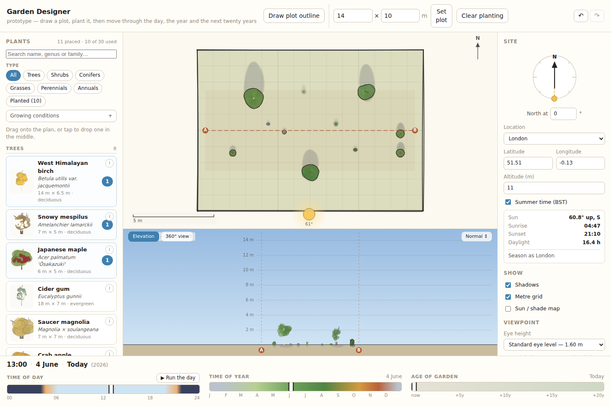
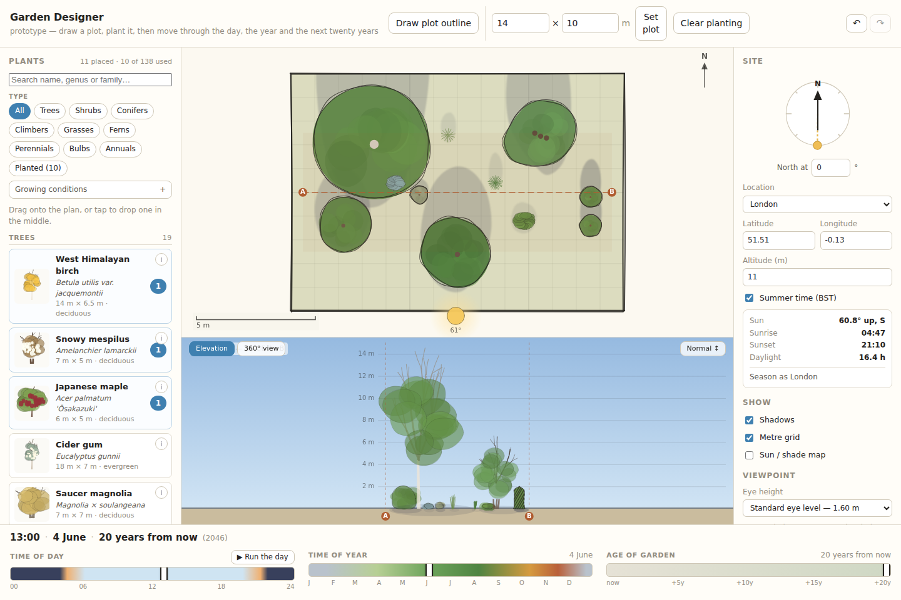
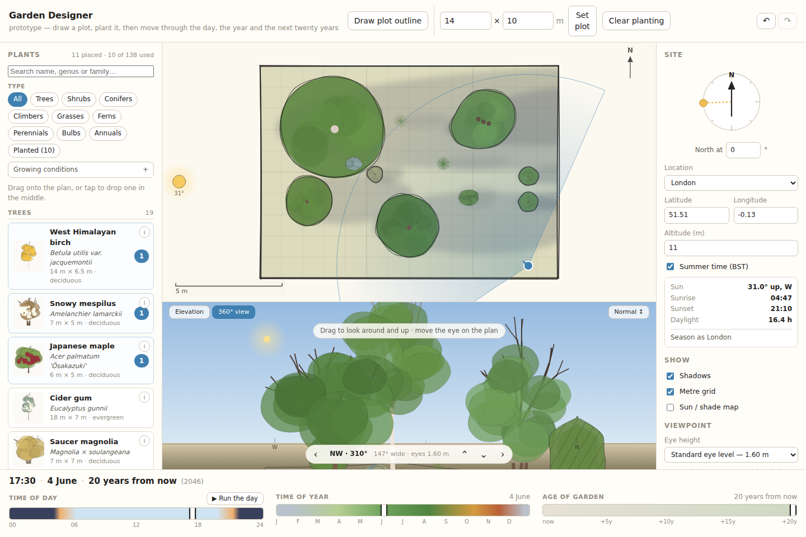
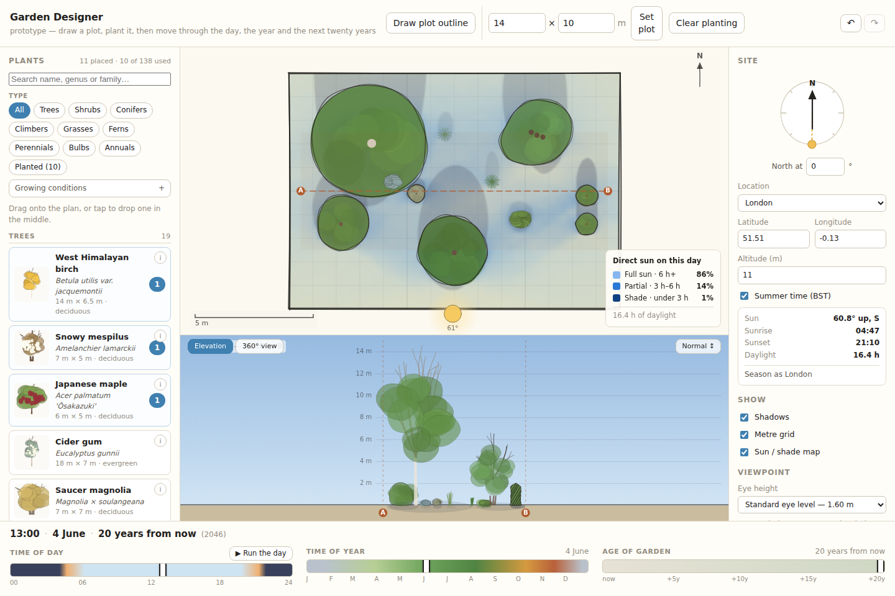

# proto-garden-designer

A prototype of a garden-design simulation for semi-professional garden designers.

Draw a plot, drag in plants, then scrub three sliders — **time of day**, **time of
year**, and **age of the garden** out to twenty years — and watch the design
respond. Shadows sweep round and lengthen, the light warms and cools, leaves come
and go, autumn colour arrives, and the planting grows up.

The same design on the same June afternoon, on the day it goes in and twenty
years later:

| Year 0 | Year 20 |
|---|---|
|  |  |

Three ways of looking at it: the **plan** you arrange on, a measured **elevation**
through a slice of it — five to twenty metres deep, as you choose — and a
**360° view** from an eye point inside the garden that you can turn and tilt.



**Live at <https://marekkultys.com/proto-garden-designer/>** — no install, works
on a phone.

Built to test whether the interaction idea has depth rather than to be a
comprehensive plant database. Every plant in it is researched rather than
invented, and the palette is chosen to span the axes the simulation actually
exercises — trees, shrubs, conifers, climbers, grasses, ferns, perennials, bulbs
and annuals. [PLANTS.md](PLANTS.md) holds the current list, and the count.

Plants go in either as nursery stock or as a ten-year-old specimen, so one
bought-in tree can give a design structure on the day it is planted while
everything round it is still a whip.

Walls and raised beds can be drawn on the plan, given a height, and reshaped
afterwards by dragging their corners or drawing the outline again. Both are part
of the simulation, not marks on a drawing: a wall throws a real shadow into the
sun map and hides what is behind it in the 360° view, and a raised bed lifts the
plants standing in it.

Designs save as named projects in the browser, so a garden survives closing the
tab, and export/import as a JSON file carries one between machines. Nothing is
sent anywhere and there is no backend.

The library is filtered by type and by growing conditions — aspect, soil type,
soil pH, drainage, foliage, size and hardiness — so a border with dry shade on
chalk narrows the whole library to the few dozen that will actually take it. A
**Mediterranean** button beside the types gathers the dry, sunny,
silver-and-aromatic palette in one press.

📄 **[PRODUCT.md](PRODUCT.md)** — what it is, where the brief came from, what it
does, what was deliberately left out, and the roadmap.

## Quick start

```bash
npm install
npm run dev        # http://localhost:5173
npm run verify     # the gate: types, tests, and both build targets
npm run build      # production build into dist/
npm run plants:md  # rewrite the generated lists in PLANTS.md from the library
```

For something you can email to a tester, or open by double-clicking with no
server at all:

```bash
SINGLEFILE=1 npm run build            # one self-contained dist/index.html, well under 1 MB
node scripts/check-singlefile.mjs     # confirms it runs from file:// with zero network requests
```

## Project layout

```
src/model/    the simulation — sun, growth, phenology, shade, panorama geometry,
              walls and raised beds (structures.ts), and the plant data itself
              (plants/, one file per type, stitched back together by plants/index.ts
              in the order given by plants/order.ts — which is what numbers them
              in PLANTS.md, so it is kept even though nothing else reads it)
src/render/   canvas drawing — sketchy line work, the light palette, and one
              draw pass per view (plant/ holds the drawing of a plant itself,
              split by view and by the shapes that needed a file of their own;
              chrome.ts holds the interface's own colours, which the stylesheet
              is given at startup because a canvas cannot read a CSS variable)
src/state/    one zustand store, assembled in store.ts from a file per subject
              in slices/ — the plot, the planting, what is built on it, what is
              selected, the site, the view, undo, and projects; all state is
              plain and serialisable, plus the save/load boundary (projectFile.ts
              is pure and browser-free, projectStorage.ts is the only code that
              touches localStorage, and projectTransfer.ts exports and imports a
              design as a file)
src/ui/       React components: the panels, the canvases, the time bar
              (library/ holds the plant library's parts — the chips, a card, a
              thumbnail; which plants match is model/plants/filter.ts, because
              that is a question about plants rather than about a screen)
scripts/      Playwright checks and screenshot capture
build/        the one Vite plugin this needs — folding the whole build into a
              single self-contained index.html
```

## What is simulated

Everything on all three canvases is a pure function of `(design, site, time)`.

**Sun position** — [`src/model/sun.ts`](src/model/sun.ts). The NOAA solar position
equations, not an approximation. Sunrise and sunset land within a couple of
minutes of published times, and the tests check that against London figures
rather than against the code's own output. This is what makes latitude, longitude
and the north dial mean something.

**Light colour** — [`src/render/palette.ts`](src/render/palette.ts). Sun altitude
sets a colour temperature, from about 1900 K at the horizon to 5800 K high.

**Growth** — [`src/model/growth.ts`](src/model/growth.ts). A logistic curve from
nursery stock to mature size, height and spread on separate curves. Clipped
subjects gain a fixed amount a year and then stop, because somebody is cutting
them. Climbers stop rising at trellis height and then run along it as far as their
own vigour takes them, since there is no wall or pergola here for one to climb,
and you choose which way that run goes.

**Phenology** — [`src/model/phenology.ts`](src/model/phenology.ts). Day-of-year
anchors per species, shifted for the site by Hopkins' bioclimatic law — about four
days later per degree of latitude north and per 120 m of altitude.

**The lie of the land** — [`src/model/terrain.ts`](src/model/terrain.ts). A fall
across the plot in one direction. Shadows use it: a shadow thrown downhill
chases ground running away beneath it and reaches further, one thrown uphill is
cut short, and both come out of one exact expression rather than a fudge.

**Sun and shade** — [`src/model/shade.ts`](src/model/shade.ts). Steps the sun
across the sky and projects every canopy onto the ground, accumulating light per
quarter-metre cell. Walls and raised beds
([`src/model/structures.ts`](src/model/structures.ts)) cast into the same map as
opaque swept footprints.



See [PRODUCT.md](PRODUCT.md) for what each of these buys a designer, and for the
trade-offs each one makes.

## Implementation notes worth knowing

Four decisions that look arbitrary until you have hit the thing they avoid.

**A plant's skeleton is generated once and cached** —
[`src/render/form.ts`](src/render/form.ts). Branch forks, leaf-mass positions and
outline wobble are all decided from the instance seed and then held fixed, so
rendering only varies size, colour and how much is visible. Deciding them while
drawing seems equivalent and is not: the number of leaf clumps changes as the
season slider moves, which changes how much randomness has been consumed, which
rearranges everything after it. Scrubbing time would look like the garden being
replanted every frame.

**Hue and brightness are applied separately** —
[`src/render/palette.ts`](src/render/palette.ts). The tint is whichever light
falls on a surface — the beam in sun, the blue sky in shadow — normalised to unit
luminance so it only shifts colour, with brightness applied on top. Multiplying
the two together, which is the obvious implementation, makes everything drift
cold and grey at exactly the moment it should be going golden.

**The elevation strip's vertical scale is fixed to the *mature* size of the
planting**, never the current size. If it refitted as plants grew, everything
would stay the same size on screen and the age slider would appear to do nothing.

**A swept shadow is filled as one path, with every subpath wound the same way** —
[`src/render/structure.ts`](src/render/structure.ts). The ground a wall shades is
its footprint, its translated copy, and a quad per edge joining the two. Filling
those separately double-darkens every overlap, and a wall's own segments overlap
at each corner — so they go into one path and are filled once. But a nonzero fill
*cancels* where two subpaths of opposite winding overlap, and the side quads a
sweep produces wind against their own footprint. Left alone the shadow rubs
itself out and the drawing shows bare grass while the sun map says the garden is
shaded.

**Exporting asks the host when there is one, and uses a link when there is not** —
[`src/state/projectTransfer.ts`](src/state/projectTransfer.ts). A `download` link
works on an ordinary page and is *silently inert* inside the artifact sandbox,
which never grants a page permission to start its own download — so the app
would have reported writing a file that was never written. Published as an
artifact it asks the host to save instead, and the viewer confirms. Preferring
the capability where it exists and falling back to the link where it does not is
what lets one build be honest in both places.

**Loading a design filters plants it no longer recognises** —
[`src/state/projectFile.ts`](src/state/projectFile.ts). `getSpecies` throws on an
unknown id and there is no error boundary, so a saved design naming a renamed or
deleted plant would not lose that plant — it would white-screen the app, and keep
doing it on every reload, because the bad data is still in storage. Until saving
existed this was impossible: state died with the tab, so the data was always
exactly as old as the code. Saving is what opens that gap, and every future edit
to the palette widens it. Unknown plants are dropped at the load boundary and
counted, so the app reports what it could not restore instead of dying.

**Undo coalesces a drag into one step** —
[`src/state/slices/history.ts`](src/state/slices/history.ts). Moving a plant fires an update on
every pointer move, and one undo step per frame would be useless. Rather than
have pointer handlers announce when a gesture begins and ends — easy to get wrong,
easy to forget in a new handler — consecutive edits carrying the same key within
600 ms fold into one entry.

**Sixteen plant shapes, not one.** `src/render/form.ts` builds a skeleton per
habit and `src/render/plant.ts` draws it in both plan and elevation — a tree, a
clipped column, a grass tussock, a fern shuttlecock, a tree fern on its trunk, a
flower spire over basal leaves, a climber as a sheet of leaf on a trellis, and
four trained trees. A plant whose habit has no draw path does not fail loudly; it
falls through to the generic tree and renders a clematis as a small shrub, which
is why a test asserts that every habit is used and a browser check screenshots
one of each. TypeScript will not catch it either: the elevation `switch` has a
`default`, so a new habit compiles cleanly and draws wrongly.

The trained trees keep their skeleton in `form.trained`, apart from the fields a
free-grown crown uses. Those fields are read with offsets that suit a crown —
flowers are pushed into the upper half and widened — so reusing them put a fan's
cherries in the air between its ribs; and `form.flowers` is overwritten for every
plant after its shape is built. Everything in `form.trained` is a literal
position, which is what lets a test check that fruit sits on the framework.

The 360° view is worth one more note: it is a **cylindrical** projection, mapping
angle linearly to pixels, not a flat perspective plane. A pinhole projection
multiplies by `tan(angle)`, which runs away at the edges and makes a wide view
unusable. One consequence looks like a bug and is not — horizontal and vertical
share one scale, so on a short panel the view opens out *wider* than asked rather
than magnifying vertically. The readout says how wide, and the cone drawn on the
plan comes from the field actually rendered.

## Verification

One command, run before committing anything non-trivial:

```bash
npm run verify
```

It runs every check that needs no browser and no person — the types compile, the
model and store tests pass, and both build targets still build — and reports each
stage separately:

```
  ok   types — 1.8s
  ok   tests — 1.3s
  ok   build — 2.0s
  ok   single file — 2.0s

all 4 stages passed — 7.2s
```

Every stage runs even after one fails. When a change breaks two things at once,
being told both beats fixing one and rerunning to find the other. A failing stage
prints its own output and the script exits non-zero, so CI can use it unchanged.

`npm test` on its own is still there for the tight loop while writing a model.

The documents are part of what is checked. Every count this README, `PRODUCT.md`
and `PLANTS.md` state about the library — how many plants, how many of each type,
how many shapes, how many under the Mediterranean button — is compared with the
library itself, so after adding plants `npm run verify` lists each sentence that
needs its number changing, worded exactly as it should read. History is not
checked: "the palette began at ten plants" stays true however large it grows.

The checklist in `PLANTS.md` goes further: the numbered lists are not written by
hand at all but generated from the library, so a plant cannot be missing from it,
filed under the wrong type, or carry a number that points at something else.

```bash
npm run plants:md   # rewrite the generated lists after changing the library
```

It touches only what sits between the `<!-- generated: … -->` markers; the
prose, the "still to build" list and the fixes worth doing are hand-written and
left alone. Whether a plant is FULL or PARTIAL is data too — the sentence saying
what is missing lives in [`src/model/plants/gaps.ts`](src/model/plants/gaps.ts),
next to the library it describes, so closing a gap and claiming it is closed are
the same edit. A test compares the file on disk with what the generator would
write, which is the same question as "is the checklist current?".

The models are where silent errors hide, so the unit tests check them against
published figures rather than against themselves: London solar noon altitude and
sunrise/sunset times, growth monotonic and hitting mature size at year 20, hosta
dormant in January, altitude delaying bud burst, and cross-checks that the soil
axes cannot contradict each other, that no two plants share an id, and that every
drawable plant shape has at least one plant using it.

A plant's shape is chosen in three places — the skeleton it is built from, the
plan, and the side view — and leaving a new shape out of any of them used to be
silent: a generic tree in the side view, a blob on the plan, and in the skeleton
nothing at all, which cannot look wrong because nothing is drawn. Each of the
three now ends by handing the shape to `unhandled` in
[`src/render/exhaustive.ts`](src/render/exhaustive.ts), which compiles only when
every shape has been accounted for. Add one to the `Habit` union and the build
stops, naming the shape and the three lines that need it.

The browser checks drive the real app through `window.gardenStore` and assert
behaviour a screenshot alone would not catch. The nine that decide for
themselves run as one command — it builds the single file, serves it, runs them
all and tears down, in about forty seconds:

```bash
npm run check:browser
```

That is also what the deploy workflow runs before publishing to GitHub Pages, so
a drawing regression stops the deploy instead of reaching a gardener. Pass
`--skip-build` when `dist/` is already current.

To run one on its own, or to run the two that only produce pictures:

```bash
npx vite preview --port 4173

node scripts/screenshots.mjs    http://localhost:4173 screenshots  # the slider matrix, to look at
node scripts/check-mobile.mjs   http://localhost:4173 screenshots  # the document must not scroll at all
node scripts/check-panorama.mjs http://localhost:4173 screenshots  # turning must change what is in front of you
node scripts/check-editing.mjs  http://localhost:4173 screenshots  # duplicate-in-place, eye height, hover states
node scripts/check-habits.mjs   http://localhost:4173 screenshots  # every plant shape actually draws
node scripts/check-library.mjs  http://localhost:4173              # portraits are drawn late, but never late enough to see
node scripts/check-drawing.mjs  http://localhost:4173              # the drawing, against docs/golden
node scripts/readme-images.mjs  http://localhost:4173 docs/img     # the images in this file
```

`check-drawing.mjs` is the one that compares pictures. Ten plants once vanished
from the side views for weeks, every winter, and were found by someone happening
to look at January — the drawing's output is a canvas, and what is wrong with it
is what it looks like. It could not be automated before because every plant gets
a random seed when it is planted, so no two runs drew the same sketch; the check
writes a design straight into the store with seeds of its own, which makes seven
scenes reproducible to the pixel. Those scenes are the plan, the side view in
midsummer, spring, autumn and January, the 360° view, and the sun map, against
the references in `docs/golden/`.

Two dates would not be enough: a plant can be right at both solstices and vanish
in between, which is exactly where that bug lived. Putting it back turns three
scenes red, and each failure leaves `screenshots/<scene>.actual.png` and a diff
with every changed pixel in magenta. When a change is meant, `--update` accepts
it — deliberately, after looking, and worth a line in the commit saying why the
drawing changed.

`check-library.mjs` guards an optimisation that is invisible when it works and
obvious when it breaks. The library holds a card per plant, and each card's
portrait is the elevation drawing in miniature; drawing all of them on load
cost fourteen megabytes of canvas and a stall on every filter, for the six that
fit on screen. They are now drawn when their card comes within eight hundred
pixels of the library's scrolling box — a figure chosen by measurement, since
too short a lookahead shows empty boxes to anyone dragging the scrollbar. The
check drags the list from top to bottom in sixty frames and fails on a single
blank, and fails equally if every portrait is drawn on load again.

And against the built single file, which is what testers actually receive.
`npm run check:browser` does all of this; the pieces are here for running one:

```bash
SINGLEFILE=1 npm run build
node scripts/check-singlefile.mjs    # runs from file://, zero off-origin requests
node scripts/check-narrow.mjs        # tablet portrait and desktop
node scripts/make-artifact.mjs       # repackage as an embeddable fragment
node scripts/check-artifact.mjs
```

Those last two defaulted to nothing and printed their findings without failing,
which is why running them by hand used to produce `file://undefined/` and why a
sideways-scrolling layout could pass. Both now default to the file in `dist/`
and exit non-zero when they find something.

`screenshots/` is gitignored — it holds the sweep you look through by eye. Only
the few images in `docs/img/` are committed, which is why `readme-images.mjs` is
the one to give an output directory unless you mean to replace them.

Each check takes `[url|file] [outDir]`, and needs the browser installed once with
`npx playwright install chromium`.

### The advisories `npm audit` used to report, and why it reports none

Until October 2026 this said that `npm audit` found three high-severity
advisories — one fault counted three times: `braces` is vulnerable to
[stack exhaustion through deeply nested glob patterns](https://github.com/advisories/GHSA-vfj7-8cjw-p6xm),
`micromatch` depends on `braces`, and `vite-plugin-singlefile` depended on
`micromatch`. They were accepted deliberately: a build-time dependency only,
reaching the vulnerable call at two lines both guarded by a glob pattern we
never passed, and with no patched `braces` to move to — 3.0.3 is both the latest
release and the vulnerable one. `npm audit fix --force` "fixed" it by
downgrading the plugin a major version and breaking the single-file build.

That note said the decision should be re-made rather than inherited, and it was.
The plugin did one thing: paste the built script and stylesheet into
`index.html`. That is now [`build/inline.ts`](build/inline.ts), about forty
lines we own, and the dependency is gone along with all three advisories.

The replacement is stricter in the way that matters. The old plugin would
happily emit an HTML file referring to files it had deleted, which looks perfect
until someone opens it with no network — the one condition the single file
exists for. Ours fails the build instead, naming the file it could not inline.
Its output is otherwise the same: byte-identical JavaScript, byte-identical CSS
apart from a `/*$vite$:1*/` marker the plugin left behind, and two redundant
attributes dropped from the tags.

What would change the picture now: any advisory at all, since there are none to
tune out. One touching `react`, `react-dom` or `zustand` would be in the app
itself rather than on the machine that builds it, and would need acting on
rather than recording.

## Deploying

Live at **<https://marekkultys.com/proto-garden-designer/>**.

Merging to `master` publishes it. [`.github/workflows/deploy.yml`](.github/workflows/deploy.yml)
installs, runs the tests, builds, and uploads — and the test step is a gate, so a
red suite stops the deploy rather than shipping a broken prototype to a tester.
There is also a manual *Run workflow* button for publishing without a version
bump. GitHub Actions is free on public repositories, and a run takes about a
minute.

What gets published is the **single-file** build, not the ordinary one. Two
reasons, and the first is the one that bites: a normal Vite build writes absolute
asset paths, which break the moment a site is served from a sub-path like
`/proto-garden-designer/`. With everything inlined there are no asset paths to
get wrong. The second is that it is byte-for-byte the file already emailed to
testers, so the hosted and sent versions cannot drift apart.

The URL comes from the repository name, appended to the custom domain on the
**user site** (`marek-kultys.github.io`, which serves `marekkultys.com`). Project
sites inherit that domain only while they have no custom domain of their own, so
the Pages *Custom domain* field for this repo is deliberately blank. Renaming the
repo moves the URL.

A domain attached to a *project* repo does not work this way — it serves that one
repo at its root and nothing beneath it. That is why `melayerka.com`, which is the
custom domain on the `melayerka_art` repo, has no
`melayerka.com/proto-garden-designer`. Serving this app from that domain means
either a subdomain of it or publishing into that repo; see
[PRODUCT.md](PRODUCT.md#publishing-it).

The Playwright checks are deliberately not run in CI, because they need a browser
download the gate should not pay for on every push. The model and store tests are
the device-free half, and they are what the gate runs.

They do run locally. Install the browser once with `npx playwright install
chromium`; the commands are under [Verification](#verification) above.

These used to name one container's absolute paths — the browser at
`/opt/pw-browsers`, the build under `/home/user` — so none of them would start
anywhere else, including on the machine the app is built on. Paths now resolve
against the script's own location, and Playwright finds its own browser.

## Testing with gardeners

`window.gardenStore` is exposed in the browser — in every build, not only in
development — so a scenario can be set up from the console on a call, rather
than by dragging. What that door costs, and when it would have to be shut, is in
`PRODUCT.md` under *Known trade-offs*.

```js
const s = window.gardenStore.getState();
s.addPlant('betula-jacquemontii', { x: 4, y: 3 });
s.setTime({ doy: 288, hour: 15, year: 12 });   // mid-October afternoon, 12 years on
s.toggle('showOverlay');
```
